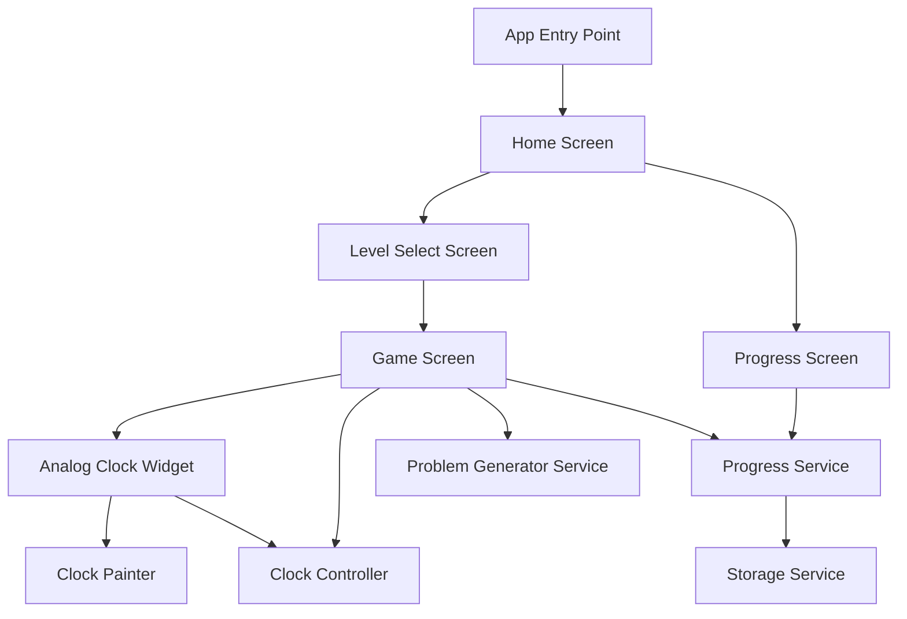
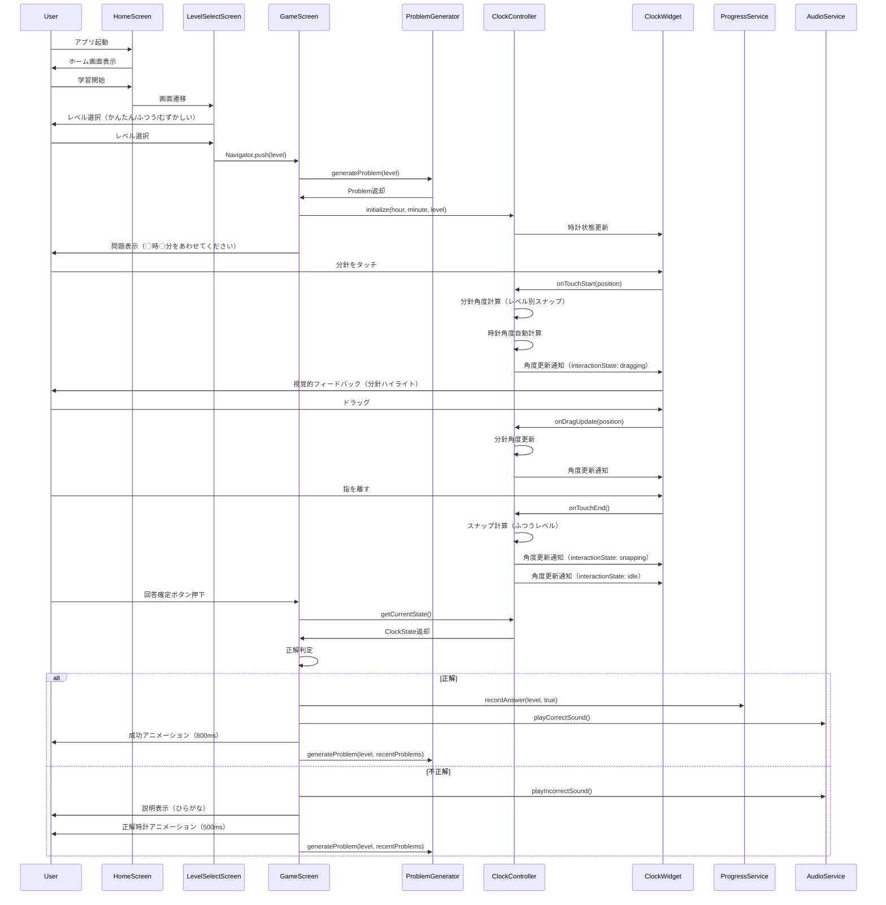
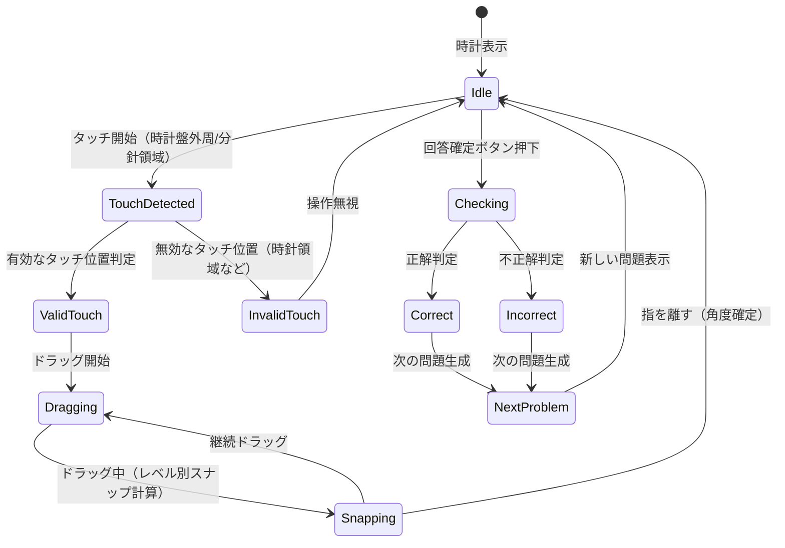

# Design Document

## Overview
この機能は、未就学児（3〜6歳）がアナログ時計の読み方を楽しく学べるスマートフォンアプリケーションを提供する。分針を操作して指定された時間に合わせるインタラクティブな学習体験を通じて、時計の概念を段階的に理解できるようにする。

**Purpose**: 未就学児が直感的に時計を操作し、3つの難易度レベル（かんたん・ふつう・むずかしい）で段階的に時計の読み方を学習できる。

**Users**: 未就学児（3〜6歳）が主要ユーザー。保護者・教育者が副次ユーザーとして進捗を確認できる。

**Impact**: 既存のFlutterテンプレートアプリを、完全な時計学習アプリケーションに変換する。アナログ時計ウィジェット、レベル選択、問題生成、進捗管理などの新規機能を追加する。

### Goals
- 分針を操作して時間を合わせる直感的な学習体験を提供する
- 3つの難易度レベル（かんたん：正時、ふつう：5分刻み、むずかしい：1分刻み）で段階的な学習を実現する
- 未就学児が操作しやすい大きなUI要素とひらがな表記を提供する
- 学習進捗をローカルに保存し、達成感を提供する
- オフラインで完全に動作する

### Non-Goals
- デジタル時計の学習機能（アナログ時計のみ）
- 秒針の表示（時針・分針のみ）
- オンライン機能（オフライン動作のみ）
- 複数ユーザー管理（単一ユーザーの進捗管理のみ）
- 音声認識機能（タッチ操作のみ）
- タブレット対応（初期リリースではスマートフォンのみ）
- ダークモード対応（初期リリースではライトモードのみ）
- 多言語対応（初期リリースでは日本語のみ）

## Architecture

### Architecture Pattern & Boundary Map



**Architecture Integration**:
- Selected pattern: **Layered Architecture with Controller Pattern** - UI層、コントローラー層、ビジネスロジック層、データ層を明確に分離
- Domain/feature boundaries: 画面（Screen）、ウィジェット（Widget）、コントローラー（Controller）、サービス（Service）、データモデル（Model）で責任を分離
- Existing patterns preserved: Flutterの標準的なStatefulWidget/StatelessWidgetパターンを維持
- New components rationale:
  - `ClockWidget`: アナログ時計の描画専任（CustomPainterを使用）
  - `ClockPainter`: CustomPainter実装、時計盤と針の描画
  - `ClockController`: 分針操作のロジック、スナップ計算、時針自動調整を担当（単方向データフロー）
  - `ProblemGenerator`: レベルに応じた問題生成を担当
  - `ProgressService`: 学習進捗の管理を担当
  - `StorageService`: ローカルデータ永続化を担当
- Steering compliance: 単一責任の原則、DRY原則、KISS原則に従う
- **状態管理の選定根拠**: Providerを選択。理由：軽量で学習曲線が緩やか、Riverpodは過剰な機能。状態の流れは単方向（GameScreen → ClockController → ClockWidget）

### Technology Stack

| Layer | Choice / Version | Role in Feature | Notes |
|-------|------------------|-----------------|-------|
| Frontend | Flutter 3.10.7+ | UI構築とアニメーション | Material Design使用 |
| State Management | Provider ^6.1.1 | 状態管理 | 軽量で学習曲線が緩やか |
| Data Persistence | SharedPreferences ^2.2.2 | 進捗データの保存 | シンプルなKey-Valueストアで十分 |
| Animation | Flutter SDK | 時計針のアニメーション | CustomPainterとAnimationControllerを使用 |
| Animation Assets | Lottie | 成功/失敗アニメーション | 軽量、ファイルサイズが小さい |
| Audio | audioplayers ^5.2.1 | 音声フィードバック | クロスプラットフォーム対応 |

## Platform Requirements

### OS Support
| Platform | Minimum Version | Target Version | 理由 |
|----------|-----------------|----------------|------|
| Android  | 8.0 (API 26)    | 14 (API 34)    | 未就学児の端末は中古が多いため、古いOSもサポート |
| iOS      | 14.0            | 17.0           | iPhone 6s以降をサポート |

### Flutter/Dart Version
| Tool    | Version   | 備考 |
|---------|-----------|------|
| Flutter | 3.24.0+   | 安定版の最新 |
| Dart    | 3.5.0+    | sealed class対応 |

### 画面サイズ
| 種別 | 最小 | 最大 | 対応方針 |
|------|------|------|----------|
| 幅   | 320dp | 428dp | レスポンシブ対応 |
| 高さ | 568dp | 926dp | 時計サイズを画面幅の80%に設定 |

### 端末の向き
- **縦向き（Portrait）固定**
- 横向きは非対応（未就学児の操作性を考慮）
- 実装：`SystemChrome.setPreferredOrientations([DeviceOrientation.portraitUp])`

### タブレット対応
- 初期リリースでは非対応（Non-Goals）
- 将来対応時は時計サイズの最大値を設定（例：最大400dp）

## System Flows

### 学習フロー



### 分針操作フロー



## Requirements Traceability

| Requirement | Summary | Components | Interfaces | Flows |
|-------------|---------|------------|------------|-------|
| 1.1-1.8 | アナログ時計表示・操作 | ClockWidget, ClockPainter, ClockController, GameScreen | ClockState, ClockController | 分針操作フロー |
| 2.1-2.5 | レベル選択 | LevelSelectScreen | LevelSelectionState | 学習フロー |
| 3.1-3.7 | かんたんレベル学習 | GameScreen, ProblemGenerator, ClockController | Problem, GameState | 学習フロー |
| 4.1-4.8 | ふつうレベル学習 | GameScreen, ProblemGenerator, ClockController | Problem, SnappingBehavior | 学習フロー、分針操作フロー |
| 5.1-5.8 | むずかしいレベル学習 | GameScreen, ProblemGenerator, ClockController | Problem, FreeRotationBehavior | 学習フロー、分針操作フロー |
| 6.1-6.5 | ゲーム形式学習 | GameScreen, ProgressService | GameSession, Score | 学習フロー |
| 7.1-7.5 | 進捗管理 | ProgressScreen, ProgressService, StorageService | ProgressData, Achievement | - |
| 8.1-8.8 | UI/UX要件 | 全Screen, ClockWidget, AnswerButton | Theme, TextStyle, TouchTarget | 学習フロー |
| 9.1-9.5 | パフォーマンス | 全コンポーネント, PerformanceMonitor | PerformanceMetrics | - |
| 10.1-10.5 | セキュリティ・プライバシー | StorageService | EncryptionStrategy | - |

## Components and Interfaces

### UI Layer

#### HomeScreen
| Field | Detail |
|-------|--------|
| Intent | アプリのホーム画面。学習開始と進捗確認へのナビゲーションを提供 |
| Requirements | 1.1 |
| Owner / Reviewers | - |

**Responsibilities & Constraints**
- アプリ起動時の初期画面として機能
- 学習開始ボタンと進捗確認ボタンを表示
- 未就学児向けの大きなボタンとカラフルなデザイン

**Dependencies**
- Outbound: LevelSelectScreen — 学習開始時の遷移先 (P0)
- Outbound: ProgressScreen — 進捗確認時の遷移先 (P1)

**Contracts**: State [✓]

##### State Management
- State model: `HomeScreenState` - 画面の表示状態を管理
- Persistence & consistency: 状態は画面内のみ、永続化不要
- Concurrency strategy: 単一ウィジェットツリー内での状態管理

**Implementation Notes**
- Material DesignのScaffoldを使用
- 大きなタッチ領域（最小48x48dp）を確保
- ひらがな表記でボタンラベルを表示

#### LevelSelectScreen
| Field | Detail |
|-------|--------|
| Intent | 3つの難易度レベル（かんたん・ふつう・むずかしい）から選択する画面 |
| Requirements | 2.1, 2.2, 2.3, 2.4, 2.5 |
| Owner / Reviewers | - |

**Responsibilities & Constraints**
- 3つのレベルボタンを表示
- レベル選択時にGameScreenへ遷移
- 選択されたレベル情報をGameScreenに渡す

**Dependencies**
- Inbound: HomeScreen — 画面遷移元 (P0)
- Outbound: GameScreen — レベル選択後の遷移先 (P0)

**Contracts**: State [✓]

##### State Management
- State model: `LevelSelectState` - 選択されたレベルを保持
- Persistence & consistency: 選択状態は遷移時にGameScreenへ渡す
- Concurrency strategy: 単一選択のみ

**Implementation Notes**
- 3つの大きなカード型ボタンでレベルを表示
- レベル名は「かんたん」「ふつう」「むずかしい」をひらがなで表示
- タップ時にアニメーションでフィードバック

#### GameScreen
| Field | Detail |
|-------|--------|
| Intent | 時計学習のメイン画面。問題表示、時計操作、正解判定を担当 |
| Requirements | 1.1, 1.2, 1.3, 1.4, 1.5, 1.6, 1.7, 1.8, 3.1-3.7, 4.1-4.8, 5.1-5.8, 6.1-6.5 |
| Owner / Reviewers | - |

**Responsibilities & Constraints**
- 問題文の表示（「◯時◯分をあわせてください」）
- ClockWidgetの表示と操作
- 正解判定とフィードバック
- 進捗の記録
- 次の問題への自動遷移

**Dependencies**
- Inbound: LevelSelectScreen — レベル情報の受け取り (P0)
- Outbound: ClockWidget — 時計表示と操作 (P0)
- Outbound: ClockController — 時計操作のロジック (P0)
- Outbound: ProblemGenerator — 問題生成 (P0)
- Outbound: ProgressService — 進捗記録 (P0)
- Outbound: AudioService — 音声フィードバック (P1)

**Contracts**: State [✓], Service [✓]

##### State Management
- State model: `GameState` - 現在の問題、時計の状態、スコア、正解判定結果を管理
- Persistence & consistency: ゲームセッション中の状態のみ、終了時にProgressServiceへ保存
- Concurrency strategy: 単一ゲームセッション内での状態管理

##### Service Interface
```dart
abstract class ProblemGeneratorService {
  Problem generateProblem(Level level);
  bool validateAnswer(Problem problem, Time userAnswer);
}
```
- Preconditions: 有効なLevelが指定される
- Postconditions: 指定されたレベルに応じた問題が生成される
- Invariants: 生成される問題は常に有効な時間範囲内

**Implementation Notes**
- Providerを使用してGameStateを管理
- **状態の粒度**: GameStateを以下のサブ状態に分離
  - `ProblemState`: 現在の問題情報
  - `ClockState`: 時計の状態（ClockControllerから取得）
  - `SessionState`: スコア、連続正解数など
- **画面遷移パターン**: Navigator引数を使用（推奨）
```dart
// LevelSelectScreen → GameScreen
Navigator.push(
  context,
  MaterialPageRoute(
    builder: (_) => GameScreen(level: selectedLevel),
  ),
);
```
  - 理由：シンプルで型安全、状態の複雑化を避けられる
  - 代替案：go_routerを使用する場合はPathParametersを検討
- 正解時は成功アニメーションと音声フィードバック
- 不正解時は優しい説明と正解の表示（ひらがな表記）
- **回答確定ボタン**: 
  - 位置：画面下部中央
  - サイズ：最小80x80dp（未就学児向けの大きなボタン）
  - ラベル：「こたえをきめる」（ひらがな表記）
  - アイコン：チェックマーク（視覚的補助）
  - 押下時の挙動：正解判定を実行し、結果に応じてフィードバック表示
- **問題重複排除**: 直近10問との重複チェックを実装（同じ問題が連続して出題されない）
- **エッジケース対応**:
  - 12時0分の問題：hour=12, minute=0として出題（「12時」と表示）
  - 時計盤の中心タッチ：無効タッチとして無視
  - 画面回転：縦固定（portrait only）で実装
  - 端末フォントサイズ変更：sp単位で対応済み

#### ProgressScreen
| Field | Detail |
|-------|--------|
| Intent | 学習進捗、正解率、学習日数、達成バッジを表示 |
| Requirements | 7.1, 7.2, 7.3, 7.4, 7.5 |
| Owner / Reviewers | - |

**Responsibilities & Constraints**
- 完了したレベル、正解率、学習日数を表示
- 達成バッジやメダルの表示
- 連続学習日数の表示

**Dependencies**
- Inbound: HomeScreen — 画面遷移元 (P1)
- Outbound: ProgressService — 進捗データの取得 (P0)

**Contracts**: State [✓]

##### State Management
- State model: `ProgressScreenState` - 進捗データの表示状態
- Persistence & consistency: ProgressServiceからデータを取得して表示
- Concurrency strategy: 読み取り専用の表示

**Implementation Notes**
- カラフルなカード型UIで進捗を表示
- バッジやメダルは視覚的に分かりやすく表示
- 数字は数字で、説明はひらがなで表示

### Widget Layer

#### ClockWidget
| Field | Detail |
|-------|--------|
| Intent | アナログ時計の描画専任ウィジェット。分針操作のUIを提供 |
| Requirements | 1.1, 1.2, 1.3, 1.4, 1.5, 1.6, 8.1, 8.2, 8.3 |
| Owner / Reviewers | - |

**Responsibilities & Constraints**
- 時針・分針の描画（秒針は表示しない）
- 1〜12の数字を時計盤に表示
- タッチイベントの検出（時計盤外周、分針領域、時針領域の判定）
- ドラッグ中の視覚的フィードバック（分針の色変化、ハイライト）
- スムーズなアニメーション（60fps）
- **アクセシビリティ**: 分針先端だけでなく、時計盤外周全体と分針全体をタッチターゲットとして認識

**Dependencies**
- Inbound: ClockController — 時計状態（角度）の受け取り (P0)
- Outbound: ClockController — タッチ位置の通知 (P0)
- Outbound: ClockPainter — 描画処理の委譲 (P0)

**Contracts**: State [✓]

##### State Management
- State model: `ClockWidgetState` - 表示用の時針・分針の角度のみを保持（読み取り専用）
- Persistence & consistency: ClockControllerから状態を受け取り、描画のみを担当
- Concurrency strategy: 単一の時計インスタンスでの操作

**Implementation Notes**
- ClockPainter（CustomPainter）を使用して時計盤と針を描画
- GestureDetectorでタッチ操作を検出
- **タッチターゲット**: 時計盤外周（半径の80%〜100%の範囲）と分針全体（分針の長さの50%以上）を有効なタッチ領域とする
- **誤操作防止**: 
  - 時針領域（時針の長さの50%以上）へのタッチは無視
  - **時計盤の中心タッチ**: 中心から半径の20%以内のタッチは無効として無視
- **視覚的フィードバック**: ドラッグ中は分針の色を変更（例：通常の黒→青）して操作中であることを明示
- **2本指操作の無効化**: 同時に2本以上の指でタッチされた場合は最初の1本のみを有効とする
- **高速ドラッグ対応**: フレーム間補間で分針を追従（1秒で360度回転しても滑らかに追従）
- **画面回転**: 縦固定（portrait only）で実装（`SystemChrome.setPreferredOrientations([DeviceOrientation.portraitUp])`）
- **端末フォントサイズ変更**: sp単位で対応済み（Flutterのデフォルト動作）

#### ClockPainter
| Field | Detail |
|-------|--------|
| Intent | CustomPainter実装。時計盤と針の描画を担当 |
| Requirements | 1.1, 1.2, 1.3, 1.5, 9.2 |
| Owner / Reviewers | - |

**Responsibilities & Constraints**
- 時計盤の円形描画
- 1〜12の数字の配置と描画
- 時針・分針の描画（太さ、長さ、色の区別）
- パフォーマンス最適化（再描画の最小化）

**Dependencies**
- Inbound: ClockWidget — 描画パラメータ（角度、サイズ）の受け取り (P0)

**Contracts**: - 

**Implementation Notes**
- CustomPainterを継承して実装
- `shouldRepaint`で再描画の必要性を判定（角度が変更された場合のみ再描画）
- 数字は1〜12を時計盤に配置（12時を上、3時を右、6時を下、9時を左）

#### ClockController
| Field | Detail |
|-------|--------|
| Intent | 時計のビジネスロジックを担当。分針操作、スナップ計算、時針自動調整 |
| Requirements | 1.7, 1.8, 4.4, 5.4 |
| Owner / Reviewers | - |

**Responsibilities & Constraints**
- 分針角度の計算（タッチ位置から角度への変換）
- レベルに応じたスナップ動作（ふつう：5分刻み、むずかしい：1分刻み）
- 分針の位置に応じた時針角度の自動計算
- 時計状態の管理（現在の時・分）
- **単方向データフロー**: GameScreen → ClockController → ClockWidget

**Dependencies**
- Inbound: GameScreen — レベル情報、目標時間の設定 (P0)
- Inbound: ClockWidget — タッチ位置の通知 (P0)
- Outbound: ClockWidget — 計算された角度の通知 (P0)
- Outbound: GameScreen — 現在の時間の通知 (P0)

**Contracts**: Service [✓], State [✓]

##### Service Interface
```dart
enum ClockInteractionState {
  idle,              // 待機中
  dragging,          // ドラッグ中
  snapping,          // スナップアニメーション中
  animatingResult,   // 正解/不正解アニメーション中
}

class ClockState {
  final int hour;      // 1〜12
  final int minute;    // 0〜59
  final double hourAngle;   // ラジアン（12時を0として時計回り）
  final double minuteAngle; // ラジアン（12時を0として時計回り）
  final ClockInteractionState interactionState; // 操作状態
}

abstract class ClockController {
  void initialize(int hour, int minute, Level level);
  void onTouchStart(Offset position, Size clockSize);
  void onDragUpdate(Offset position, Size clockSize);
  void onTouchEnd();
  ClockState getCurrentState();
  int getCurrentHour();   // 1〜12
  int getCurrentMinute(); // 0〜59
}
```
- Preconditions: 有効なタッチ位置と時計サイズが指定される
- Postconditions: 分針角度が更新され、時針角度が自動調整される
- Invariants: 時針角度は常に分針の位置に応じて計算される

**Implementation Notes**
- **スナップ計算**: 
  - かんたん：常に0分（12時の位置）にスナップ
  - ふつう：5分刻み（0, 5, 10, 15, 20, 25, 30, 35, 40, 45, 50, 55分）にスナップ
  - むずかしい：1分刻みで自由に配置
- **時針自動調整アルゴリズム**: 
```dart
double calculateHourAngle(int hour, int minute) {
  // hour: 1〜12, minute: 0〜59
  // 12時を0度として時計回りに計算
  final hourBase = (hour % 12) * 30.0;  // 1時間 = 30度
  final minuteOffset = minute * 0.5;     // 1分 = 0.5度（時針は1時間で30度動く = 1分で0.5度）
  return (hourBase + minuteOffset) * (pi / 180); // ラジアンに変換
}

double calculateMinuteAngle(int minute) {
  // minute: 0〜59
  // 12時を0度として時計回りに計算
  return minute * 6.0 * (pi / 180); // 1分 = 6度
}
```
  - 時針は1時間で30度、1分で0.5度動く
  - 分針は1分で6度動く
  - 12時を0度（または2πラジアン）として時計回りに計算
- **角度計算**: タッチ位置（Offset）から時計中心への角度を計算し、分針の角度として設定
- **状態遷移**: 
  - `idle` → `dragging`: タッチ開始時
  - `dragging` → `snapping`: ドラッグ終了時（ふつうレベルで5分刻みにスナップ）
  - `snapping` → `idle`: スナップアニメーション完了時
  - `idle` → `animatingResult`: 正解判定後（成功/失敗アニメーション中は操作無効）
  - `animatingResult` → `idle`: アニメーション完了時
- **高速ドラッグ対応**: フレーム間補間で分針を追従（1秒で360度回転しても滑らかに追従）

### Service Layer

#### ProblemGenerator
| Field | Detail |
|-------|--------|
| Intent | レベルに応じた問題を生成するサービス |
| Requirements | 3.1, 4.1, 5.1 |
| Owner / Reviewers | - |

**Responsibilities & Constraints**
- レベルに応じた問題生成
  - かんたん：正時（0分）のみ
  - ふつう：5分刻み（0, 5, 10, 15, 20, 25, 30, 35, 40, 45, 50, 55分）
  - むずかしい：1分刻み（0〜59分）
- ランダムな問題生成
- 正解判定ロジック

**Dependencies**
- Inbound: GameScreen — 問題生成要求 (P0)
- Outbound: GameScreen — 問題データ返却 (P0)

**Contracts**: Service [✓]

##### Service Interface
```dart
enum Level { easy, normal, hard }

abstract class ProblemGeneratorService {
  Problem generateProblem(Level level, {List<Problem>? recentProblems});
  bool validateAnswer(Problem problem, int userHour, int userMinute);
  String formatQuestion(Problem problem); // ひらがなで問題文を生成
}
```
- Preconditions: 有効なLevelが指定される
- Postconditions: 指定されたレベルに応じた有効な問題が生成される（直近10問との重複なし）
- Invariants: 生成される時間は常に1時0分〜12時59分の範囲内（hour: 1〜12, minute: 0〜59）

**Implementation Notes**
- ランダムな時間生成で問題の多様性を確保
- **問題重複排除**: 直近10問（`recentProblems`）との重複チェックを実装
- 問題文は「◯時◯分をあわせてください」の形式でひらがな表記（例：「3時15分をあわせてください」）
- **12時0分の問題**: hour=12, minute=0として出題（「12時」と表示、「12時0分」ではなく「12時」と簡潔に）
- 正解判定は時・分の両方が一致することを確認
- **適応的難易度調整**（将来拡張）: 連続正解時に自動レベルアップ提案、連続不正解時にヒント表示、苦手な時間帯の重点出題

#### ProgressService
| Field | Detail |
|-------|--------|
| Intent | 学習進捗の管理と永続化を担当するサービス |
| Requirements | 7.1, 7.2, 7.3, 7.4, 7.5 |
| Owner / Reviewers | - |

**Responsibilities & Constraints**
- 学習データの保存と読み込み
- 正解率の計算
- 学習日数の追跡
- 達成バッジの管理
- 連続学習日数の計算

**Dependencies**
- Inbound: GameScreen — 進捗更新要求 (P0)
- Inbound: ProgressScreen — 進捗データ取得要求 (P1)
- Outbound: StorageService — データ永続化 (P0)

**Contracts**: Service [✓], State [✓]

##### Service Interface
```dart
class ProgressData {
  final Map<Level, LevelProgress> levelProgress;
  final int totalCorrectAnswers;
  final int totalQuestions;
  final DateTime lastLearningDate;
  final int consecutiveDays;
  final List<Achievement> achievements;
}

class LevelProgress {
  final int completedProblems;
  final int correctAnswers;
  final int totalAttempts;
}

class Achievement {
  final String id;
  final String name; // ひらがな表記
  final DateTime unlockedAt;
}

abstract class ProgressService {
  Future<void> recordAnswer(Level level, bool isCorrect);
  Future<ProgressData> getProgress();
  Future<List<Achievement>> getAchievements();
  Future<void> updateLearningDate();
}
```
- Preconditions: 有効なLevelと回答結果が指定される
- Postconditions: 進捗データが永続化され、次回起動時に読み込まれる
- Invariants: 正解率は常に0.0〜1.0の範囲内

**Implementation Notes**
- StorageServiceを使用してローカルにデータを保存
- 日付変更を検出して連続学習日数を更新
- 達成条件を満たした場合にバッジを付与

#### AudioService
| Field | Detail |
|-------|--------|
| Intent | 音声フィードバックを提供するサービス |
| Requirements | 3.5, 4.6, 5.6, 8.4 |
| Owner / Reviewers | - |

**Responsibilities & Constraints**
- 正解・不正解時の音声再生
- 音量制御とミュート機能
- 音声アセットの管理

**Dependencies**
- Inbound: GameScreen — 音声再生要求 (P1)
- External: audioplayers ^5.2.1 — 音声再生ライブラリ (P1)

**Contracts**: Service [✓]

##### Service Interface
```dart
class AudioSettings {
  final bool isMuted;        // ミュート状態
  final double volume;       // 0.0〜1.0（端末の音量設定に従う）
  
  AudioSettings({
    this.isMuted = false,
    this.volume = 1.0,
  });
}

abstract class AudioService {
  Future<void> playCorrectSound();
  Future<void> playIncorrectSound();
  Future<void> setMuted(bool muted);
  Future<void> setVolume(double volume); // 0.0〜1.0
  AudioSettings getSettings();
}
```
- Preconditions: 音声アセットが正しく配置されている
- Postconditions: 音声が再生される（ミュート時は再生されない）
- Invariants: 音量は常に0.0〜1.0の範囲内

**Implementation Notes**
- **音声アセット**:
  - 形式：OGG Vorbis（Android/iOS両対応、ファイルサイズが小さい）
  - サイズ制限：各音声ファイルは最大100KB（メモリ50MB制限を考慮）
  - 配置：`assets/audio/`ディレクトリ
  - ファイル名：`correct.ogg`, `incorrect.ogg`
- **音量制御**: 端末の音量設定に従う（独自の音量設定は提供しない）
- **ミュート機能**: 保護者が設定画面で音を消せる（SharedPreferencesで保存）
- **ライブラリ**: `audioplayers ^5.2.1`を使用（軽量でクロスプラットフォーム対応）

#### StorageService
| Field | Detail |
|-------|--------|
| Intent | ローカルデータの永続化を担当するサービス |
| Requirements | 7.1, 10.2 |
| Owner / Reviewers | - |

**Responsibilities & Constraints**
- SharedPreferencesを使用したKey-Valueストレージ
- 進捗データの保存と読み込み
- データの暗号化（必要に応じて）

**Dependencies**
- Inbound: ProgressService — データ保存・読み込み要求 (P0)
- External: SharedPreferences — データ永続化 (P0)

**Contracts**: Service [✓]

##### Service Interface
```dart
abstract class StorageService {
  Future<void> saveProgressData(ProgressData data);
  Future<ProgressLoadResult> loadProgressData();
  Future<void> clearAllData();
  Future<String?> exportProgressData(); // バックアップ用（JSON文字列）
  Future<bool> importProgressData(String jsonData); // リストア用
}
```
- Preconditions: 有効なProgressDataが指定される
- Postconditions: データがローカルストレージに保存される
- Invariants: データは常にJSON形式でシリアライズされる

**Implementation Notes**
- SharedPreferencesを使用してシンプルなKey-Valueストレージを実現
- **スキーマバージョン管理**: 
```json
{
  "schemaVersion": 1,
  "progressData": { ... }
}
```
  - スキーマバージョンを導入し、将来のデータ構造変更に対応
  - バージョン不一致時はマイグレーション処理を実行（現時点ではv1のみ）
- JSON形式でデータをシリアライズ
- **バックアップ・リストア機能**: 
  - `exportProgressData()`: 進捗データをJSON文字列としてエクスポート（保護者が手動でコピー可能）
  - `importProgressData()`: JSON文字列から進捗データをインポート（端末変更時のデータ移行）
- エラー時は適切な例外をスロー

## Data Models

### Domain Model

#### Time (Value Object)
- **Hour**: 1〜12の整数（時計盤表示に合わせた12時間表記）
- **Minute**: 0〜59の整数
- **Invariants**: Hourは1〜12、Minuteは0〜59の範囲内
- **内部計算**: 時計計算時のみ0〜11に変換（`internalHour = hour % 12`）

#### Problem (Entity)
型安全性を向上させるため、sealed classでレベル別の型を定義：

```dart
sealed class Problem {
  final int hour;  // 1〜12
  final String questionText; // ひらがな表記
  
  factory Problem.easy(int hour) {
    assert(hour >= 1 && hour <= 12);
    return EasyProblem(hour, 0);
  }
  
  factory Problem.normal(int hour, FiveMinuteInterval minute) {
    assert(hour >= 1 && hour <= 12);
    return NormalProblem(hour, minute);
  }
  
  factory Problem.hard(int hour, int minute) {
    assert(hour >= 1 && hour <= 12);
    assert(minute >= 0 && minute <= 59);
    return HardProblem(hour, minute);
  }
}

class EasyProblem extends Problem {
  final int minute; // 常に0
  EasyProblem(super.hour, this.minute) : assert(minute == 0);
}

class NormalProblem extends Problem {
  final FiveMinuteInterval minute; // 5分刻みのみ
  NormalProblem(super.hour, this.minute);
}

class HardProblem extends Problem {
  final int minute; // 0〜59
  HardProblem(super.hour, this.minute) : assert(minute >= 0 && minute <= 59);
}

enum FiveMinuteInterval {
  zero(0), five(5), ten(10), fifteen(15), twenty(20), 
  twentyFive(25), thirty(30), thirtyFive(35), 
  forty(40), fortyFive(45), fifty(50), fiftyFive(55);
  
  final int value;
  const FiveMinuteInterval(this.value);
}
```

- **Level**: 難易度レベル（easy, normal, hard）
- **TargetTime**: 目標時間（Time: 1〜12時、0〜59分）
- **QuestionText**: 問題文（ひらがな表記、「◯時◯分をあわせてください」）
- **Invariants**: 
  - EasyProblem: minuteは常に0
  - NormalProblem: minuteはFiveMinuteInterval（5分刻み）のみ
  - HardProblem: minuteは0〜59の任意の値
  - すべてのProblemでhourは1〜12

#### ProgressData (Aggregate Root)
- **LevelProgress**: レベル別の進捗（Map<Level, LevelProgress>）
- **TotalCorrectAnswers**: 総正解数
- **TotalQuestions**: 総問題数
- **LastLearningDate**: 最終学習日
- **ConsecutiveDays**: 連続学習日数
- **Achievements**: 達成バッジのリスト
- **Invariants**: 正解率は0.0〜1.0の範囲内

### Logical Data Model

**Structure Definition**:
- **ProgressData**: JSON形式で保存
  - `levelProgress`: オブジェクト（キー：レベル名、値：LevelProgress）
  - `totalCorrectAnswers`: 整数
  - `totalQuestions`: 整数
  - `lastLearningDate`: ISO 8601形式の日時文字列
  - `consecutiveDays`: 整数
  - `achievements`: 配列（Achievementオブジェクトのリスト）

**Consistency & Integrity**:
- トランザクション境界: 各進捗更新は原子操作として保存
- データ整合性: JSONスキーマ検証でデータ形式を保証
- 一時的側面: 最終学習日を記録して連続学習日数を計算

### Data Contracts & Integration

**Local Storage Schema**:
```json
{
  "schemaVersion": 1,
  "progressData": {
    "levelProgress": {
      "easy": {
        "completedProblems": 10,
        "correctAnswers": 8,
        "totalAttempts": 12
      },
      "normal": { ... },
      "hard": { ... }
    },
    "totalCorrectAnswers": 25,
    "totalQuestions": 30,
    "lastLearningDate": "2026-01-12T21:00:00Z",
    "consecutiveDays": 3,
    "achievements": [
      {
        "id": "first_correct",
        "name": "はじめてのせいかい",
        "unlockedAt": "2026-01-10T10:00:00Z"
      }
    ]
  }
}
```

**マイグレーション戦略**:
- スキーマバージョンが不一致の場合、マイグレーション処理を実行
- 現時点ではv1のみ。将来のバージョン追加時は、v1→v2、v2→v3の順にマイグレーションを実行
- マイグレーション失敗時はデータ破損として扱い、ユーザーに通知

## Error Handling

### Error Strategy
- **User Errors**: 入力検証エラーは視覚的フィードバックで通知（ひらがなメッセージ）
- **System Errors**: データ読み込みエラーは型安全な結果型で処理
- **Business Logic Errors**: 無効な操作は警告メッセージで通知

### Error Categories and Responses
**User Errors**:
- 無効な時計操作（時針領域へのタッチ） → 操作を無視し、現在の状態を維持
- 2本指での操作 → 最初の1本のみを有効とし、他は無視

**System Errors**:
- **データ読み込み失敗**: 型安全な結果型で処理
```dart
sealed class ProgressLoadResult {
  const ProgressLoadResult();
}

class ProgressLoadSuccess extends ProgressLoadResult {
  final ProgressData data;
  const ProgressLoadSuccess(this.data);
}

class ProgressLoadCorrupted extends ProgressLoadResult {
  final String message; // ひらがな表記
  const ProgressLoadCorrupted(this.message);
}

class ProgressLoadFirstLaunch extends ProgressLoadResult {
  const ProgressLoadFirstLaunch();
}
```
  - `ProgressLoadCorrupted`: データ破損を検出した場合、ユーザーに通知（「データがこわれています。リセットしますか？」）し、リセットオプションを提供
  - `ProgressLoadFirstLaunch`: 初回起動の場合、オンボーディング表示
  - `ProgressLoadSuccess`: 正常に読み込めた場合、進捗データを使用
- ストレージ書き込み失敗 → エラーログを記録し、ユーザーに通知（「データを保存できませんでした。もう一度おためしください。」）、次回起動時に再試行
- メモリ不足 → 軽量なデータ構造を使用し、必要に応じてデータを圧縮

**Business Logic Errors**:
- 無効なレベル選択 → デフォルトで「かんたん」レベルを選択
- 問題生成失敗 → デフォルト問題（1時0分）を生成
- リトライ機構: データ読み込み失敗時は最大3回まで再試行

### Monitoring
- エラー発生時はFlutterの標準ログ機能を使用
- 本番環境では必要に応じてCrashlyticsなどのクラッシュレポートツールを統合
- エラーログにはコンテキスト情報（画面名、操作内容、エラー種別）を含める

## Testing Strategy

### Unit Tests
- `ProblemGenerator.generateProblem()`: 各レベルで正しい形式の問題が生成されることを確認、直近10問との重複チェック
- `ProblemGenerator.validateAnswer()`: 正解・不正解の判定が正確であることを確認（hour: 1〜12, minute: 0〜59）
- `ProgressService.recordAnswer()`: 進捗データが正しく更新されることを確認
- `StorageService.saveProgressData()` / `loadProgressData()`: データの保存と読み込みが正しく動作することを確認、スキーマバージョン管理
- `ClockController.calculateMinuteAngle()`: タッチ位置から分針角度への変換が正確であることを確認
- `ClockController.calculateHourAngle()`: 分針角度から時針角度への自動計算が正確であることを確認
- `ClockController.snapToLevel()`: レベルに応じたスナップ動作が正確であることを確認（ふつう：5分刻み、むずかしい：1分刻み）
- **境界値テスト**:
```dart
// 時間の境界
test('最小時', () => expect(calculateHourAngle(1, 0), closeTo(30.0 * pi / 180, 0.01)));
test('最大時', () => expect(calculateHourAngle(12, 0), closeTo(0.0, 0.01)));
test('最大時・最大分', () => expect(calculateHourAngle(12, 59), closeTo(29.5 * pi / 180, 0.01)));

// 角度の境界
test('12時の位置', () => expect(calculateMinuteAngle(0), closeTo(0.0, 0.01)));
test('12時直前', () => expect(calculateMinuteAngle(59), closeTo(354.0 * pi / 180, 0.01)));

// スナップの境界（ふつうレベル）
test('2分は0分にスナップ', () => expect(snapToLevel(2, Level.normal), equals(0)));
test('3分は5分にスナップ', () => expect(snapToLevel(3, Level.normal), equals(5)));
test('57分は55分にスナップ', () => expect(snapToLevel(57, Level.normal), equals(55)));
test('58分は0分（次の時）にスナップ', () => expect(snapToLevel(58, Level.normal), equals(0)));
```

### Integration Tests
- レベル選択からゲーム開始までのフロー
- 問題生成から正解判定までのフロー（重複チェック含む）
- 進捗記録から進捗表示までのフロー
- データ読み込みエラー時のフォールバック処理

### E2E/UI Tests
- ホーム画面からレベル選択、ゲーム開始までのユーザーフロー
- 分針操作から正解判定までのインタラクション
- 進捗画面でのデータ表示確認
- **未就学児特有の操作パターン**:
  - 高速な連続タップ（誤操作防止の確認）
  - 画面外へのドラッグ（操作の無効化確認）
  - 2本指での操作（最初の1本のみ有効の確認）
  - 親指での操作（持ち方による操作の確認）

### Golden Tests
- **時計描画のピクセル単位検証**: Flutter Golden Testを使用
  - 各レベルの時計表示（かんたん：正時、ふつう：5分刻み、むずかしい：1分刻み）
  - 分針操作中の視覚的フィードバック（ハイライト状態）
  - 正解・不正解時のアニメーション状態
  - 異なる画面サイズでの表示確認

### Performance/Load
- 時計アニメーションの60fps維持
  - **測定方法**: Flutter DevToolsのPerformanceタブでフレームレートを計測
  - **アラート閾値**: 3フレーム連続で16.67ms（60fps）を超過した場合に警告
  - **低スペック端末での動作検証**: Android 14以上、iOS 17以上の最小スペック端末で検証
- 大量の問題生成時のパフォーマンス
- データ保存・読み込みのレスポンスタイム（目標：100ms以内）

## UI/UX Design Details

### 分針操作のアクセシビリティ設計

#### タッチターゲットサイズ
- **分針先端**: 最小タッチ領域48x48dpを確保（分針先端の周囲に透明なタッチ領域を拡張）
- **時計盤外周**: 時計盤の半径の80%〜100%の範囲を有効なタッチ領域とする
- **分針全体**: 分針の長さの50%以上を有効なタッチ領域とする
- **誤操作防止**: 時針領域（時針の長さの50%以上）へのタッチは無視

#### 視覚的フィードバック
- **ドラッグ中**: 分針の色を変更（通常の黒→青）して操作中であることを明示
- **ハイライト**: 分針が操作可能な状態であることを示す視覚的インジケーター（オプション）
- **スナップ位置**: ふつうレベルで5分刻みにスナップする際、スナップ位置を視覚的に示す（例：小さな点を表示）

#### 操作の無効化
- **2本指操作**: 同時に2本以上の指でタッチされた場合は最初の1本のみを有効とする
- **画面外ドラッグ**: 画面外へドラッグした場合は操作を無効化し、最後の有効な位置を維持

### 回答確定ボタンの設計詳細

#### 位置とサイズ
- **位置**: 画面下部中央
- **サイズ**: 最小80x80dp（未就学児向けの大きなボタン）
- **マージン**: 画面端から最小16dpのマージン

#### ラベルとアイコン
- **ラベル**: 「こたえをきめる」（ひらがな表記）
- **アイコン**: チェックマーク（視覚的補助）
- **フォントサイズ**: 最小24sp（読みやすさを確保）

#### 押下時の挙動
- **正解時**: 
  - 成功アニメーション（例：花火、星のアニメーション）
    - **アニメーション時間**: 800ms
    - **ライブラリ**: Lottie（軽量、ファイルサイズが小さい）
    - **アセット**: `assets/animations/success.json`（最大50KB）
    - **アニメーション内容**: 星が時計の周りを回る、花火が上がる
  - 音声フィードバック（「せいかい！」など）
  - 次の問題への自動遷移（1秒後）
- **不正解時**: 
  - 説明表示（「こたえは◯時◯分です」ひらがな表記）
  - 正解の時計表示（分針が正解位置にアニメーション）
    - **アニメーション時間**: 500ms
    - **アニメーション内容**: 分針が正解位置までスムーズに移動
  - 次の問題への自動遷移（3秒後）

#### アニメーション設定
```dart
class AnimationConfig {
  static const Duration correctAnimationDuration = Duration(milliseconds: 800);
  static const Duration incorrectAnimationDuration = Duration(milliseconds: 500);
  static const Duration snapAnimationDuration = Duration(milliseconds: 150);
  static const Duration nextProblemDelay = Duration(milliseconds: 1000);
  static const Duration incorrectExplanationDelay = Duration(milliseconds: 3000);
}
```

### 数字と文字の表記ルール

#### 数字の表示
- **時計盤の数字**: 1, 2, 3, ..., 12（数字で表示）
- **問題文の時間**: 「3時15分」（数字で表示）
- **進捗画面の数値**: 正解数、問題数などは数字で表示

#### 文字の表示
- **問題文**: 「◯時◯分をあわせてください」（ひらがな表記）
- **ボタンラベル**: 「はじめる」「こたえをきめる」（ひらがな表記）
- **説明文**: すべてひらがな表記（未就学児が読めるように）

## Edge Cases and Special Handling

### 時間表現のエッジケース
| ケース | 対応 |
|-------|------|
| 12時0分の問題 | hour=12, minute=0として出題（「12時」と表示） |
| 12時59分の問題 | hour=12, minute=59として出題（「12時59分」と表示） |
| 1時0分の問題 | hour=1, minute=0として出題（「1時」と表示） |

### タッチ操作のエッジケース
| ケース | 対応 |
|-------|------|
| 時計盤の中心タッチ | 中心から半径の20%以内のタッチは無効として無視 |
| 時針領域へのタッチ | 時針の長さの50%以上へのタッチは無視 |
| 画面外へのドラッグ | 操作を無効化し、最後の有効な位置を維持 |
| 高速ドラッグ（1秒で360度） | フレーム間補間で分針を追従 |
| 2本指での操作 | 最初の1本のみを有効とし、他は無視 |

### 画面・端末設定のエッジケース
| ケース | 対応 |
|-------|------|
| 画面回転 | 縦固定（portrait only）で実装 |
| 端末フォントサイズ変更 | sp単位で対応済み（Flutterのデフォルト動作） |
| 低メモリ環境 | メモリ使用量を監視し、必要に応じてデータを圧縮 |

### データのエッジケース
| ケース | 対応 |
|-------|------|
| データ破損 | `ProgressLoadCorrupted`として検出し、ユーザーに通知 |
| 初回起動 | `ProgressLoadFirstLaunch`として検出し、オンボーディング表示 |
| スキーマバージョン不一致 | マイグレーション処理を実行（現時点ではv1のみ） |

### 問題生成のエッジケース
| ケース | 対応 |
|-------|------|
| 直近10問との重複 | 重複チェックを実装し、異なる問題を生成 |
| 問題生成失敗 | デフォルト問題（1時0分）を生成 |

## Security Considerations
- **データ保護**: ローカルストレージのみを使用し、個人情報を収集しない
- **オフライン動作**: ネットワーク通信を一切行わない
- **データ暗号化**: 進捗データは機密情報ではないため、暗号化は不要（将来の拡張時に検討可能）

## Store Requirements

### App Store (iOS)
| 要件 | 対応 |
|------|------|
| 年齢レーティング | 4+ |
| プライバシーポリシー | 必須（データ収集なしでも必要） |
| App Privacy Labels | 「データ収集なし」を申告 |
| Screenshots | 5.5", 6.5", 6.7"（必須）、iPad（任意） |

### Google Play (Android)
| 要件 | 対応 |
|------|------|
| コンテンツレーティング | IARC（Everyone） |
| プライバシーポリシー | 必須 |
| Data Safety | 「データ収集なし」を申告 |
| ターゲット年齢層 | 「子供向け」を選択 |
| ファミリーポリシー | 準拠必須（広告なし、データ収集なし） |

### 注意事項
- Google Playのファミリーポリシーは厳格。事前に確認しないとリジェクトされる
- Crashlyticsを使用する場合は「データ収集あり」として申告が必要（匿名化された技術情報のみ）

## Legal Requirements

### プライバシーポリシー
- **必須**（データ収集なしでも必要）
- **内容**: 「本アプリは個人情報を収集しません。学習進捗はお使いの端末にのみ保存されます。」
- **掲載場所**: 
  - アプリ内設定画面
  - ストアページ（App Store、Google Play）
  - GitHubリポジトリ（オプション）

### 利用規約
- 初期リリースでは不要（任意）

### COPPA (米国児童オンラインプライバシー保護法)
- 対象外（日本国内リリースのみ）
- 海外展開時は対応必須

### 著作権表示
- オープンソースライセンス一覧をアプリ内に表示
- 対象ライブラリ：Flutter, Provider, SharedPreferences, Lottie, audioplayersなど
- 表示場所：設定画面の「ライセンス」セクション

## Performance & Scalability

### パフォーマンス要件の精緻化

#### アニメーション
- **目標**: 60fps（16.67ms/frame）を維持
- **実装**: CustomPainterとAnimationControllerを使用
- **測定方法**: 
  - Flutter DevToolsのPerformanceタブでフレームレートを計測
  - `WidgetsBinding.instance.addTimingsCallback`でフレームタイミングを監視
- **アラート閾値**: 3フレーム連続で16.67msを超過した場合に警告ログを出力
- **最適化**: `shouldRepaint`で再描画の必要性を判定し、不要な再描画を防止

#### メモリ使用量
- **目標**: 最大50MB（未就学児が使用する中古・低スペック端末を考慮）
- **測定方法**: Flutter DevToolsのMemoryタブでメモリ使用量を監視
- **最適化**: 
  - 軽量なデータ構造を使用（Map、Listの最小限の使用）
  - 不要なデータを保持しない（問題履歴は直近10問のみ）
  - 画像アセットの最適化（必要最小限のサイズ）

#### 起動時間
- **目標**: 3秒以内に初期画面を表示
- **実装**: データ読み込みは非同期で実行し、UIブロッキングを防止
- **測定方法**: アプリ起動からHomeScreen表示までの時間を計測

#### 低スペック端末での動作検証
- **対象端末**: 
  - Android: 最小RAM 2GB、Android 8.0 (API 26)以上（最小バージョン）
  - iOS: iPhone 6s以上、iOS 14.0以上（最小バージョン）
- **検証項目**: フレームレート、メモリ使用量、起動時間、操作レスポンス
- **注意**: 未就学児の端末は中古が多いため、最小バージョンでの動作検証を必須とする

#### スケーラビリティ
- 単一ユーザー向けのため、スケーリング要件はなし

## Accessibility Requirements

### 対応範囲（初期リリース）
| 項目 | 対応 | 備考 |
|------|------|------|
| VoiceOver (iOS) | 非対応 | 視覚的操作が主体のため |
| TalkBack (Android) | 非対応 | 同上 |
| 色覚多様性 | 対応 | 色だけに依存しないUI |
| フォントサイズ変更 | 対応 | sp単位で実装 |
| 減速モーション | 対応 | アニメーション時間を2倍に |

### 色覚多様性対応
- **分針ハイライト**: 色（青）＋太さ変更の併用
- **正解/不正解**: 色＋アイコン（○/×）の併用
- **コントラスト比**: WCAG AA準拠（4.5:1以上）

### 実装方針
- 色だけに依存しないUI設計（アイコン、太さ、形状を併用）
- すべてのテキストはsp単位で実装（端末のフォントサイズ設定に従う）
- アニメーションは`MediaQuery.of(context).disableAnimations`で無効化可能

## Resource Consumption

### バッテリー
- **目標**: 1時間の連続使用で5%以下の消費
- **対策**:
  - 画面オフ時はアニメーション停止
  - バックグラウンド処理なし
  - 不要なタイマーやポーリングを避ける

### ストレージ
| 項目 | サイズ |
|------|--------|
| アプリ本体 | 20MB以下 |
| 進捗データ | 100KB以下 |
| キャッシュ | なし |

### 実装方針
- アセット（画像、音声、アニメーション）のサイズを最小限に
- 不要なデータを保持しない（問題履歴は直近10問のみ）
