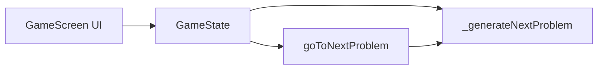

# Design Document: next-problem-after-wrong

## Overview

不正解時に自動で次の問題へ進むのをやめ、表示「つぎのもんだい」のボタンを表示し、ユーザーがタップしたときだけ次の問題に進むようにする拡張。正解時は従来どおり一定時間後に自動進行を維持する。

**対象ユーザー**: 未就学児が間違えたあと、正解を確認してから自分のペースで次に進めるようにする。

**影響**: `GameState.checkAnswer()` の末尾で不正解のときは delay と `_generateNextProblem()` を実行しないようにする。`GameState` に `goToNextProblem()` を追加し、ゲーム画面の不正解表示時に「つぎのもんだい」ボタンを表示してそのタップで `goToNextProblem()` を呼ぶ。

### Goals

- 不正解時に「ちがいます」・正解表示に加えて表示「つぎのもんだい」のボタンを表示し、自動進行しない（1.1〜1.3）
- 「つぎのもんだい」タップで次の問題を生成・表示する（2.1〜2.3）
- 正解時は従来どおりフィードバック後に自動で次に進む（3.1〜3.2）

### Non-Goals

- 正解時にも「つぎのもんだい」を出すこと（要件では不正解時のみ）
- リトライ（同じ問題をやり直す）機能
- タイマーや制限時間の追加

## Architecture

### Existing Architecture Analysis

- **現状**: ゲーム画面は `GameState` が回答確定・正解判定・進捗記録・次の問題生成を担当。`checkAnswer()` は正解・不正解とも 1.5 秒後に `_generateNextProblem()` を呼んでいる。UI は `lastResult` に応じて `_buildResultMessage()` で正解/不正解メッセージを表示し、常に「こたえをきめる」ボタンを表示している。
- **維持する境界**: 問題生成（`_generateNextProblem`）、正解判定、進捗記録、音声フィードバックは変更しない。変更は「不正解後の進行トリガー」のみ。
- **技術的負債**: 特になし。

### Architecture Pattern & Boundary Map

既存のレイヤー内拡張のため新規パターンは導入しない。

- **責務分離**: GameState は「回答確定時に正解なら自動で次へ、不正解なら次へ進まない」と「ユーザーが『つぎのもんだい』を押したときに次へ進む」の両方を担当。UI は lastResult に応じて「こたえをきめる」または「つぎのもんだい」を表示する。
- **Steering 準拠**: structure.md の screens 層の変更のみ。services / widgets は変更しない。

### Technology Stack

| Layer | Choice / Version | Role in Feature | Notes |
|-------|------------------|-----------------|-------|
| UI (screens) | Flutter (既存) | GameState.checkAnswer の分岐、goToNextProblem の追加、不正解時の「つぎのもんだい」ボタン表示 | game_screen.dart のみ変更 |

新規依存なし。

## Requirements Traceability

| Requirement | Summary | Components | Interfaces | Flows |
|-------------|---------|------------|------------|-------|
| 1.1 | 不正解時に「つぎのもんだい」ボタン表示 | GameState, GameScreen | goToNextProblem | checkAnswer 分岐 |
| 1.2 | 不正解時は自動進行しない | GameState | checkAnswer | checkAnswer 分岐 |
| 1.3 | 不正解時も正解説明は表示 | GameScreen | _buildResultMessage | 既存維持 |
| 2.1 | 「つぎのもんだい」タップで次問題表示 | GameState, GameScreen | goToNextProblem | goToNextProblem |
| 2.2 | 次問題はランダム開始で表示 | GameState | _generateNextProblem | 既存 |
| 2.3 | 不正解フィードバックを消して問題・時計のみ | GameState | _generateNextProblem | 既存 |
| 3.1 | 正解時は従来どおり自動で次へ | GameState | checkAnswer | checkAnswer 分岐 |
| 3.2 | 正解時は「つぎのもんだい」を出さない | GameScreen | ボタン条件表示 | 既存＋条件 |

## Components and Interfaces

| Component | Domain/Layer | Intent | Req Coverage | Key Dependencies (P0/P1) | Contracts |
|-----------|--------------|--------|--------------|--------------------------|-----------|
| GameState | screens | 不正解時は自動進行せず、goToNextProblem で次へ進む | 1.1, 1.2, 2.1, 2.2, 2.3, 3.1 | ClockController, ProblemGenerator, ProgressService, AudioService (既存) | State（既存＋goToNextProblem） |
| GameScreen | screens | 不正解時に「つぎのもんだい」ボタンを表示 | 1.1, 3.2 | GameState (P0) | UI のみ |

### Screens Layer

#### GameState

| Field | Detail |
|-------|--------|
| Intent | 回答確定時に正解なら自動で次問題へ、不正解なら自動進行せず、goToNextProblem 呼び出しで次問題へ進む |
| Requirements | 1.1, 1.2, 2.1, 2.2, 2.3, 3.1 |

**変更内容**

- **checkAnswer()**: 末尾の「1.5秒後に _generateNextProblem()」を、`isCorrect == true` のときのみ実行する。`isCorrect == false` のときは delay と _generateNextProblem を実行せず return。
- **goToNextProblem()**（新規）: 公開メソッド。`_generateNextProblem()` を呼び、`notifyListeners()` する。不正解表示中に UI から「つぎのもんだい」タップで呼ばれる。

**Contracts**: State（既存の ChangeNotifier に加え、goToNextProblem の公開 API を追加）

- **Preconditions**: goToNextProblem は不正解表示中（lastResult == false）に呼ばれる想定。それ以外の状態で呼んでも _generateNextProblem は実行可能。
- **Postconditions**: 呼び出し後に次の問題が生成され、lastResult が null になり、時計がランダム開始で初期化される。

#### GameScreen（_buildResultMessage およびボタン表示）

- **変更内容**: `lastResult == false` のとき、不正解メッセージ（「ちがいます」「せいかいは◯です」）に加え、表示文言「つぎのもんだい」のボタンを表示する。そのボタンの onPressed で `gameState.goToNextProblem()` を呼ぶ。`lastResult == false` のときは「こたえをきめる」は表示しない（「つぎのもんだい」に置き換える）。`lastResult == null` のときは従来どおり「こたえをきめる」のみ表示。
- **Requirements**: 1.1, 1.3, 3.2

## Data Models

本機能では永続データ・ドメインエンティティの変更はない。GameState の既存状態（lastResult, currentProblem 等）のまま利用する。

## Error Handling

- goToNextProblem は既存の _generateNextProblem を呼ぶだけであり、新規のエラー経路は想定しない。既存の正解/不正解フィードバックや進捗記録は変更しない。

## Testing Strategy

- **Unit Tests**: GameState について、checkAnswer で不正解のときは _generateNextProblem が呼ばれないこと、goToNextProblem を呼ぶと次の問題が生成されることを検証する（モックまたはスパイで _generateNextProblem 呼び出しを確認）。
- **Widget/Integration Tests**: 不正解後に「つぎのもんだい」が表示されること、タップすると次の問題に切り替わることを検証する。
- **E2E**: 既存のゲームフローに加え、意図的に不正解にして「つぎのもんだい」で次に進むパスを確認する。

## Supporting References

- 調査・判断の詳細: `research.md`
- 既存構造: `.kiro/steering/structure.md`, `.kiro/steering/tech.md`
