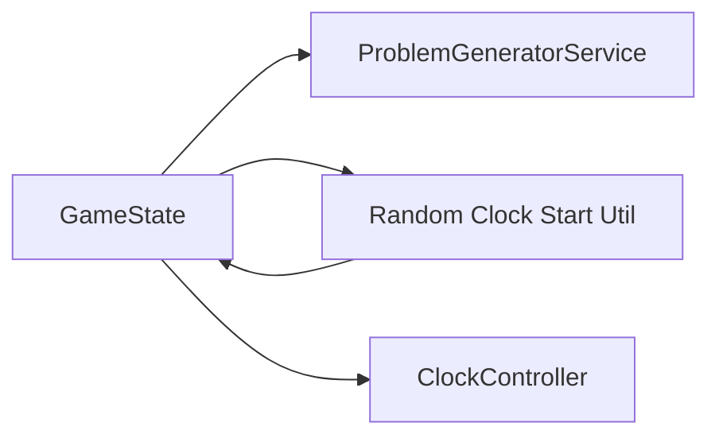

# Design Document: random-clock-start

## Overview

本機能は、問題表示時にアナログ時計の開始時刻を常時12時0分から「レベルに応じた有効範囲内のランダムな時刻」に変更する拡張である。既存のゲームフロー（問題生成・正解判定・フィードバック）は変更せず、時計の初期表示のみをランダム化する。

**対象ユーザー**: 未就学児（3〜6歳）が、12時以外の針の位置からも「時間を合わせる」練習ができるようにする。

**影響**: 現在 `GameState._generateNextProblem()` 内で固定値 `(12, 0)` を渡している箇所を、ランダムな `(hour, minute)` に差し替える。`ClockController` のインターフェースは変更しない。

### Goals

- 問題表示のたびに時計の開始時刻をレベルに応じた有効範囲でランダムに決定する（要件 1.1〜1.4）
- 開始時刻がランダムでも正解判定・目標時刻は変更しない（要件 2.1〜2.3）
- レベル別の分針操作・スナップ・フィードバックは既存どおり維持する（要件 3.1〜3.3）

### Non-Goals

- 問題の目標時刻の生成ロジックの変更（ProblemGeneratorService は触らない）
- 乱数の暗号論的強度の要件（学習アプリのため `dart:math Random` で十分）
- 設定画面での「ランダム開始の ON/OFF」などユーザー設定（将来検討は可能）

## Architecture

### Existing Architecture Analysis

- **現状**: ゲーム画面は `GameState`（ChangeNotifier）が問題生成・時計初期化・正解判定を担当。時計の表示・操作は `ClockController` が受け持ち、`initialize(hour, minute, level)` で任意の初期時刻を設定可能。
- **維持する境界**: 問題生成（ProblemGeneratorService）と正解判定（GameState.checkAnswer）は変更しない。時計の「初期表示」のみをランダム化する責務を utils に追加する。
- **技術的負債**: 特になし。固定値 (12, 0) をランダム生成に差し替えるだけの小規模拡張。

### Architecture Pattern & Boundary Map

本機能は既存レイヤー内の拡張のため、新規アーキテクチャパターンは導入しない。境界は次のとおり。

- **選択パターン**: 既存のレイヤード構成を維持。ランダム開始時刻の「計算」のみを utils に分離。
- **責務分離**: GameState は「次の問題を出す」「開始時刻を決める」「時計を初期化する」の順で既存フローを維持。開始時刻の「値」は utils が Level に基づき返す。
- **Steering 準拠**: structure.md の utils（ユーティリティ関数）に新規関数を追加。services / widgets の既存契約は変更しない。

### Technology Stack

| Layer | Choice / Version | Role in Feature | Notes |
|-------|------------------|-----------------|-------|
| Frontend / UI | Flutter (既存) | GameState が utils の戻り値を ClockController に渡す | 変更は game_screen.dart の1箇所 |
| Utils | Dart 3.x `dart:math` Random | レベルに応じた (hour, minute) のランダム生成 | 新規ファイル 1 本（utils 内） |
| Widgets | ClockController（既存） | initialize(hour, minute, level) のシグネチャはそのまま利用 | 変更なし |

新規依存パッケージは不要。`dart:math` の `Random` のみ使用する。

## Requirements Traceability

| Requirement | Summary | Components | Interfaces | Flows |
|-------------|----------|------------|------------|-------|
| 1.1 | 新問題表示時に開始時刻をランダムに決定 | GameState, Random Clock Start Util | getRandomClockStart(Level) | _generateNextProblem |
| 1.2 | 開始の「時」を 1〜12 でランダムに選択 | Random Clock Start Util | 同上 | 同上 |
| 1.3 | 開始の「分」をレベル別有効範囲でランダムに選択 | Random Clock Start Util | 同上 | 同上 |
| 1.4 | 問題切り替え・再出題のたびに異なり得る | GameState, Random Clock Start Util | 同上 | 同上 |
| 2.1 | 目標時刻（正解）は変更しない | GameState, ProblemGeneratorService | 既存の generateProblem | 同上 |
| 2.2 | 目標時刻に合わせれば正解 | GameState.checkAnswer, ClockController | 既存 | 既存 |
| 2.3 | 目標と異なれば不正解 | 同上 | 既存 | 既存 |
| 3.1 | レベルに応じた分針操作・スナップは維持 | ClockController | initialize(hour, minute, level) | 既存 |
| 3.2 | 次の問題で再度ランダム開始を適用 | GameState | 同上 | _generateNextProblem |
| 3.3 | 正解/不正解フィードバック・音声・アニメーションは変更しない | GameState, AudioService, UI | 既存 | 既存 |

## Components and Interfaces

| Component | Domain/Layer | Intent | Req Coverage | Key Dependencies (P0/P1) | Contracts |
|-----------|--------------|--------|--------------|--------------------------|-----------|
| Random Clock Start Util | utils | レベルに応じたランダムな (hour, minute) を返す | 1.1, 1.2, 1.3, 1.4 | Level (P0), Random (P1) | Service（関数） |
| GameState | screens | 問題生成後にランダム開始時刻を取得し時計を初期化 | 1.1, 1.4, 2.1, 3.2 | ClockController (P0), util (P0), ProblemGenerator (P0) | State（既存） |
| ClockController | widgets | 既存の initialize(hour, minute, level) をそのまま利用 | 3.1 | — | 既存・変更なし |

### Utils Layer

#### Random Clock Start（関数または小さなユーティリティ）

| Field | Detail |
|-------|--------|
| Intent | Level を入力とし、要件で定める有効範囲内のランダムな (hour, minute) を返す |
| Requirements | 1.1, 1.2, 1.3, 1.4 |

**Responsibilities & Constraints**

- 時: 1〜12 の一様ランダム（または同等の仕様）。
- 分: Level に応じる。easy は 0 のみ。normal は 5 分刻み（0, 5, …, 55）のいずれか。hard は 0〜59 のいずれか。
- テスト容易性のため、乱数ソースはオプション引数で注入可能とする（例: `Random?` を渡せる）。

**Dependencies**

- Inbound: 呼び出し元（GameState）から Level を渡される。
- Outbound: なし（純粋関数）。
- External: `dart:math Random`（未注入の場合はデフォルトで `Random()` を使用）。

**Contracts**: Service [x]（関数としての契約）

##### 関数の契約（Dart の型で表現）

- **シグネチャ**: `(int hour, int minute)` を返す。hour は 1〜12、minute はレベルに応じた有効値。
- **Preconditions**: Level が有効な enum 値であること。
- **Postconditions**: 戻り値はそのレベルで許容される時・分の組み合わせであること。毎回同一である必要はなく、ランダムであればよい。
- **Invariants**: hour は常に 1〜12。minute は easy なら 0、normal なら FiveMinuteInterval の値、hard なら 0〜59。

**Implementation Notes**

- 配置: `lib/utils/` に新規ファイルを追加（例: `random_clock_start.dart`）。既存の `performance_monitor.dart`, `accessibility_helper.dart` と同様の命名・配置とする。
- テスト: 単体テストで Level ごとに有効範囲外の値が返らないこと、および Random を注入した場合の再現性を検証する。
- リスク: 既存テストで「12時0分で初期化される」ことを前提にしている箇所があれば、開始時刻をモックするか許容範囲を広げる必要がある。

### Screens Layer（変更のみ記載）

#### GameState

- **変更内容**: `_generateNextProblem()` 内で、`clockController.initialize(12, 0, level)` の代わりに、utils から取得した `(hour, minute)` を用いて `clockController.initialize(hour, minute, level)` を呼ぶ。
- **Requirements**: 1.1, 1.4, 2.1, 3.2
- **Contracts**: 既存の GameState の公開 API は変更しない。問題生成・正解判定の流れはそのまま。

## Data Models

本機能では新規の永続データ・ドメインエンティティは追加しない。既存の `Level`（enum）と `FiveMinuteInterval`（enum）を参照するのみ。ランダム開始時刻はメモリ上で算出し、ClockController の状態として保持するだけである。

## Error Handling

- ランダム生成は純粋関数であり、有効な Level が渡される限り失敗しない。GameState は既存どおり ProblemGeneratorService と ClockController に依存しており、本機能追加による新規エラー経路は想定しない。
- 既存のエラーハンドリング（正解/不正解のフィードバックなど）は変更しない。

## Testing Strategy

- **Unit Tests**: Random Clock Start ユーティリティについて、Level.easy / normal / hard それぞれで返る (hour, minute) が有効範囲内であること、および Random を seed して再現性があることを検証する。
- **Integration Tests**: GameState の「次の問題を生成し時計を初期化する」フローで、初期時刻が 12:0 に固定されていないこと（複数回呼んで異なる値になり得る、またはモックで指定した値が使われること）を検証する。
- **E2E/UI Tests**: 既存のゲームフロー（問題表示 → 針を合わせる → 正解/不正解）が、ランダム開始後も変わらず動作することを確認する。必要に応じて、開始時刻に依存しないアサーションに変更する。

## Supporting References

- 調査・判断の詳細: `research.md`
- 既存構造: `.kiro/steering/structure.md`, `.kiro/steering/tech.md`
