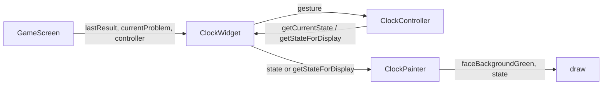

# Design Document: wrong-answer-clock-display

## Overview

問題を間違えたときに、時計の針を正解の時刻で表示し、時計の文字盤（背景）を緑にする拡張。正解時および回答確定前は従来どおり時計にユーザーの操作結果を表示し、文字盤は白のままとする。

**対象ユーザー**: 未就学児が間違えたあと、時計の針の正しい位置と「不正解であること」を視覚で確認できるようにする。

**影響**: `ClockPainter` の文字盤色をパラメータ化し、不正解時は緑で描画する。`ClockWidget` に不正解表示用のオプション（正解時刻の表示・文字盤緑・操作無効）を追加する。`ClockController` に表示用の ClockState を返すメソッドを追加する。`GameScreen` は不正解時（lastResult == false）に ClockWidget へ正解時刻と緑背景を渡す。

### Goals

- 不正解時に時計の針を正解の時刻で表示する（1.1, 1.2, 1.3）
- 不正解時に時計の文字盤を緑で表示する（2.1, 2.2, 2.3）
- 正解時・回答前は従来どおりの表示・操作を維持する（3.1, 3.2, 3.3）

### Non-Goals

- 正解時の時計の見た目変更（正解時は変更しない）
- リトライ（同じ問題をやり直す）機能
- 時計以外の不正解フィードバックの変更（「ちがいます」等は既存のまま）

## Architecture

### Existing Architecture Analysis

- **現状**: ゲーム画面は `GameState` が lastResult と currentProblem を保持。`ClockWidget` は `ClockController.getCurrentState()` を `ClockPainter` に渡し、針・文字盤を描画している。文字盤色は `ClockPainter._drawClockFace` 内で白固定。時計の角度計算は `ClockController` の `_calculateHourAngle` / `_calculateMinuteAngle` に集約されている。
- **維持する境界**: 問題生成・正解判定・進捗記録・音声・「つぎのもんだい」フローは変更しない。変更は「不正解時の時計の表示内容と見た目」のみ。
- **技術的負債**: 特になし。

### Architecture Pattern & Boundary Map

既存の widgets / screens レイヤー内拡張のため新規パターンは導入しない。

- **責務分離**: GameScreen は「いつ正解表示・緑にするか」を判断し、ClockWidget に渡す。ClockWidget は渡されたフラグ・正解時刻に応じて表示用 state を組み立て、操作の有効/無効を切り替える。ClockPainter は受け取った state と文字盤色で描画するだけ。
- **Steering 準拠**: structure.md の screens 層と widgets 層の変更のみ。services / models は変更しない。

### Technology Stack

| Layer | Choice / Version | Role in Feature | Notes |
|-------|------------------|-----------------|-------|
| UI (screens) | Flutter (既存) | GameScreen: 不正解時に ClockWidget へ正解時刻と faceBackgroundGreen を渡す | game_screen.dart のみ変更 |
| UI (widgets) | Flutter (既存) | ClockWidget: 不正解表示用パラメータを受け、state の切り替え・操作無効化。ClockPainter: 文字盤色パラメータ。ClockController: getStateForDisplay 追加 | clock_widget.dart, clock_painter.dart, clock_controller.dart |

新規依存なし。

## Requirements Traceability

| Requirement | Summary | Components | Interfaces | Flows |
|-------------|---------|------------|------------|-------|
| 1.1 | 不正解時に時計の針を正解の時刻に表示 | GameScreen, ClockWidget, ClockController, ClockPainter | getStateForDisplay, display state | lastResult == false 時に正解 state を渡す |
| 1.2 | 不正解表示中は時計を正解で固定 | ClockWidget | 表示用 state / 操作無効 | ClockWidget が正解 state を Painter に渡し Gesture 無効 |
| 1.3 | 「つぎのもんだい」後は従来どおり | GameScreen | パラメータ切り替え | lastResult != false のとき従来パラメータ |
| 2.1 | 不正解時に文字盤を緑に | ClockPainter, ClockWidget, GameScreen | faceBackgroundGreen | lastResult == false のとき true を渡す |
| 2.2 | 正解時・回答前は文字盤を従来色に | GameScreen, ClockPainter | faceBackgroundGreen: false | 従来どおり白 |
| 2.3 | 次問題に進んだ後は文字盤を従来色に | GameScreen | faceBackgroundGreen: false | 1.3 と同一 |
| 3.1 | 回答前はユーザー操作の時刻を表示 | ClockWidget, ClockController | getCurrentState | 従来どおり |
| 3.2 | 正解時は時計・文字盤を従来どおり | GameScreen, ClockWidget | パラメータなし/白 | 従来どおり |
| 3.3 | 不正解時のみ正解表示・緑を適用 | GameScreen | lastResult による分岐 | 上記の組み合わせ |

## Components and Interfaces

| Component | Domain/Layer | Intent | Req Coverage | Key Dependencies (P0/P1) | Contracts |
|-----------|--------------|--------|--------------|--------------------------|-----------|
| GameScreen | screens | 不正解時に ClockWidget へ正解時刻と緑背景を渡す | 1.1, 1.3, 2.1, 2.2, 2.3, 3.2, 3.3 | GameState (P0) | UI のみ |
| ClockWidget | widgets | 正解表示時は表示用 state を使い操作を無効化、文字盤色を Painter に渡す | 1.1, 1.2, 2.1, 3.1 | ClockController (P0), GameScreen から渡す props (P0) | State / Props |
| ClockController | widgets | 表示用 ClockState を返す API を追加 | 1.1, 1.2 | 既存の角度計算 (内部) | getStateForDisplay |
| ClockPainter | widgets | 文字盤色をパラメータで受け取り緑/白を描画 | 2.1, 2.2, 2.3 | ClockState, level (既存) | 描画契約 |

### Screens Layer

#### GameScreen（ClockWidget の呼び出し）

| Field | Detail |
|-------|--------|
| Intent | lastResult == false のとき、ClockWidget に正解時刻（currentProblem.targetTime の hour/minute）と faceBackgroundGreen: true を渡す。それ以外は従来どおり（faceBackgroundGreen: false、正解表示用パラメータなし）。 |
| Requirements | 1.1, 1.3, 2.1, 2.2, 2.3, 3.2, 3.3 |

**変更内容**

- ClockWidget の呼び出しに、次のオプションを追加する（例: 名前は実装時に合わせる）。
  - 不正解時に「正解として表示する時刻」を渡す: `displayCorrectTime: gameState.lastResult == false`、`correctHour: gameState.currentProblem!.targetTime.hour`、`correctMinute: gameState.currentProblem!.targetTime.minute`（または targetTime から取得する等価な方法）。
  - 不正解時に文字盤を緑にする: `faceBackgroundGreen: gameState.lastResult == false`。
- それ以外の状態では `displayCorrectTime: false`（または省略）、`faceBackgroundGreen: false` とする。

**Contracts**: UI のみ。既存の Consumer&lt;GameState&gt; の子として ClockWidget を配置する箇所を修正する。

### Widgets Layer

#### ClockController

| Field | Detail |
|-------|--------|
| Intent | 表示専用の ClockState（針の角度のみ、操作状態は idle）を返す API を追加し、既存の角度計算を再利用する。 |
| Requirements | 1.1, 1.2 |

**変更内容**

- **getStateForDisplay(int hour, int minute)**（または getStateForTime）: 既存の _calculateHourAngle(hour, minute) と _calculateMinuteAngle(minute) を用いて、hour, minute, hourAngle, minuteAngle, interactionState: idle の ClockState を返す。内部状態は変更しない（副作用なし）。
- **Contracts**: 入力は 1〜12 の hour、0〜59 の minute。返り値は同じ ClockState 型。Preconditions: 呼び出し側が正解の hour/minute を渡す。Postconditions: 返した state を ClockPainter に渡せば、その時刻の針が描画される。

#### ClockWidget

| Field | Detail |
|-------|--------|
| Intent | 不正解表示用のオプションを受け、表示用 state の切り替え・操作の有効/無効・文字盤色を ClockPainter に伝える。 |
| Requirements | 1.1, 1.2, 2.1, 2.2, 3.1 |

**変更内容**

- オプション引数（例）: `displayCorrectTime`（bool, デフォルト false）、`correctHour`（int?）、`correctMinute`（int?）、`faceBackgroundGreen`（bool, デフォルト false）。
- `displayCorrectTime == true` かつ correctHour / correctMinute が有効なとき: controller.getStateForDisplay(correctHour!, correctMinute!) で得た state を ClockPainter に渡す。GestureDetector は無効化するか、onPan で何もしないようにする（正解表示中は操作させない）。
- 上記でないとき: 従来どおり controller.getCurrentState() を ClockPainter に渡し、GestureDetector は有効のまま。
- `faceBackgroundGreen` はそのまま ClockPainter に渡す。
- **Contracts**: GameScreen から渡される displayCorrectTime / correctHour / correctMinute / faceBackgroundGreen の組み合わせに従い、表示と操作の可否を切り替える。

#### ClockPainter

| Field | Detail |
|-------|--------|
| Intent | 文字盤の背景色をパラメータで受け取り、不正解時は緑、それ以外は白で描画する。 |
| Requirements | 2.1, 2.2, 2.3 |

**変更内容**

- コンストラクタに **faceBackgroundGreen**（bool, デフォルト false）を追加する。
- **_drawClockFace**: faceBackgroundGreen が true のときは文字盤の fill に緑（例: Colors.green またはプロジェクトで定めた緑）を使用し、false のときは従来どおり白を使用する。縁やその他の描画は既存のまま。
- **shouldRepaint**: faceBackgroundGreen が変わった場合も再描画するように oldDelegate との比較に含める。
- **Contracts**: 受け取った state と faceBackgroundGreen に従って描画するだけ。状態の解釈は呼び出し側（ClockWidget）の責務。

## Data Models

本機能では永続データ・ドメインエンティティの変更はない。既存の ClockState、Problem（targetTime）、GameState（lastResult, currentProblem）をそのまま利用する。

## Error Handling

- getStateForDisplay は hour/minute の範囲は既存の ClockController の前提（1〜12, 0〜59）に従う。不正解表示時は currentProblem.targetTime から渡すため、通常は範囲外にならない。範囲外が渡された場合の挙動は既存の角度計算に委ねるか、実装時にガードを追加する。
- その他、新規のエラー経路は想定しない。

## Testing Strategy

- **Unit Tests**: ClockController.getStateForDisplay(hour, minute) が、既存の initialize(hour, minute, level) で得た state の hour/minute/hourAngle/minuteAngle と一致することを検証する。ClockPainter の faceBackgroundGreen が true/false のとき適切な色で描画されることを検証する（必要に応じて golden または描画結果の検証）。
- **Widget Tests**: ClockWidget に displayCorrectTime + correctHour/correctMinute を渡したとき、針が正解時刻を指すこと、および faceBackgroundGreen が true のとき文字盤が緑であることを検証する。不正解表示でないときは従来どおり操作可能であることを検証する。
- **Integration / E2E**: ゲームで意図的に不正解にし、時計が正解の時刻を指し、文字盤が緑になること、「つぎのもんだい」で次に進んだあと時計が通常表示に戻ることを確認する。

## Supporting References

- 調査・判断の詳細: `research.md`
- 既存構造: `.kiro/steering/structure.md`, `.kiro/steering/tech.md`
- 不正解表示フロー: `.kiro/specs/next-problem-after-wrong/design.md`
